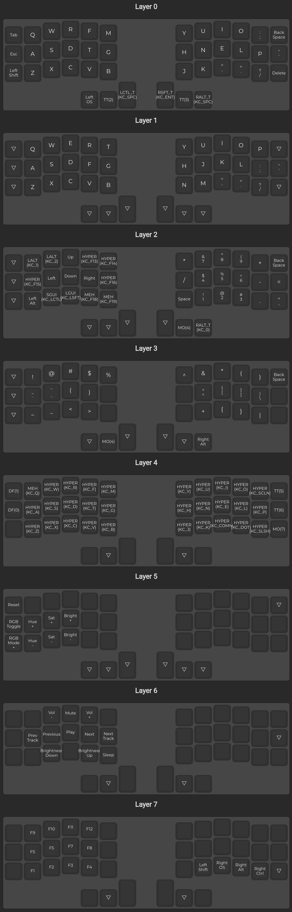

Dotfiles
========

If you run a `.bash_profile` then you should probably add this:

```bash
if [ -f ~/.bashrc ]; then . ~/.bashrc; fi
```

Table of Contents
-----------------
<!-- vim-markdown-toc GFM -->

- [Setting up my mac](#setting-up-my-mac)
  - [How to setup packages](#how-to-setup-packages)
- [Custom git setup](#custom-git-setup)
- [Custom Caching setup](#custom-caching-setup)
- [Rust setup](#rust-setup)
- [homebrew](#homebrew)
- [zsh](#zsh)
- [Making symlinks](#making-symlinks)
- [Tmux Setup](#tmux-setup)
- [Vim Setup](#vim-setup)
- [FZF setup](#fzf-setup)
- [VS Code Setup](#vs-code-setup)
  - [History](#history)
- [Vrapper Setup](#vrapper-setup)
- [vifm](#vifm)
- [vimium](#vimium)
  - [Kill sticky and similar bookmarks](#kill-sticky-and-similar-bookmarks)
- [CRKBD Keyboard Layout](#crkbd-keyboard-layout)
  - [Required steps to build](#required-steps-to-build)
  - [OS steps](#os-steps)
  - [2021-03-28 layout](#2021-03-28-layout)
  - [Building a new layout from qmk configurator](#building-a-new-layout-from-qmk-configurator)
- [MacOS Keyboard Layout](#macos-keyboard-layout)
- [Plover](#plover)
- [Emacs](#emacs)
- [Remote pbcopy](#remote-pbcopy)
- [Auto Fetch](#auto-fetch)

<!-- vim-markdown-toc -->

Setting up my mac
-----------------
1. Touchpad tap to click, keypress repeat time, alt left right to move spaces, don't auto rearrange spaces
2. accessibility drag + reduce motion
3. screen saver and screen off
4. Download chrome - disable third party cookies
5. Download install packages (see next section)
6. Show on toolbar - full datetime, bluetooth, sound, battery percentage
7. Adjust all the finder settings
8. Migrate these changes to `.macos` file

### How to setup packages
1. Install [homebrew](https://brew.sh/) `/usr/bin/ruby -e "$(curl -fsSL https://raw.githubusercontent.com/Homebrew/install/master/install)"`
2. Install oh my zsh and revert it
    ```bash
    sh -c "$(curl -fsSL https://raw.githubusercontent.com/ohmyzsh/ohmyzsh/master/tools/install.sh)"
    mv ~/.zshrc{,.bak}
    mv ~/.zshrc.pre-oh-my-zsh ~/.zshrc # probably not necessarily
    ```
3. Install tmux, clipy, fzf, ripgrep, zsh, zsh-syntax-highlighting
4. Clone dotfiles repo `git clone git@github.com:ayroblu/dotfiles.git`
5. cd in to it and run the run.sh file to symlink: `bash run.sh`
6. Install [tpm](https://github.com/tmux-plugins/tpm), `git clone https://github.com/tmux-plugins/tpm ~/.tmux/plugins/tpm`, open tmux and run `ctrl-b + I`
7. Install snappy from app store
8. Open vim and run `:PlugInstall`

Custom git setup
----------------
If you need to customise git (email for example), consider using the following gitconfig instead:

```ini
# Make sure include is first
[include]
  path = ws/dotfiles/.gitconfig
# All other settings
[user]
  name = Name Here
  email = email@email.com
```

Custom Caching setup
--------------------
I have a bespoke caching function here. This adds it to your path

```bash
ln -s $(pwd)/scripts/cache_fzf.js /usr/local/bin/cache_fzf.js
```

Rust setup
----------
```bash
# Init
brew install rustup
rustup-init
rmtrash ~/.zprofile
rmtrash ~/.profile
rustup component add rustfmt

# Install racer
rustup toolchain add nightly
cargo +nightly install racer
rustup component add rust-src
racer complete std::io::B

# Install rls (setup in vim)
rustup component add rls
```

Checkout https://crates.io/crates/cargo-outdated for when your packages go out of date

homebrew
--------
Install homebrew

Install the packages that are listed in the brew lists

To remove a package with depedencies:
https://stackoverflow.com/questions/7323261/uninstall-remove-a-homebrew-package-including-all-its-dependencies

```bash
brew tap beeftornado/rmtree
brew rmtree <package>
```

zsh
---
Sometimes terminal is slow, you can use the preload system to quickly quit and drop into a raw
shell with no rcs

```sh
mkdir ~/preload
cat <<EOF > ~/preload/.zshrc
ZDOTDIR="$HOME" zsh
exit
EOF
```

I have yet to confirm this is actually useful, may delete if ctrl-c doesn't work as is

Making symlinks
---------------
```bash
ln -s ~/ws/dotfiles/.bashrc ~/.bashrc
```

Write some code to do this:
```bash
for file in .*; do
  if [[ -f $file ]]; then
    echo ln -s $(pwd)/$file ~/$file
    ln -s $(pwd)/$file ~/$file
  fi
done
```

Tmux Setup
----------
This requires TPM:

```bash
git clone https://github.com/tmux-plugins/tpm ~/.tmux/plugins/tpm
```

Vim Setup
---------
Install plugins with vim-plug then run `:PlugInstall`

FZF setup
---------
After brew install fzf, make sure you run the key bindings setup

```bash
/usr/local/opt/fzf/install
```

VS Code Setup
-------------
First create symlink to the settings file
```bash
# https://code.visualstudio.com/docs/getstarted/settings#_settings-file-locations
# ln -s <dest> <link-file-name>
rmtrash "$HOME/Library/Application Support/Code/User/settings.json"
ln -s "$HOME/ws/dotfiles/vscode_settings.json" "$HOME/Library/Application Support/Code/User/settings.json"
```

### History

```bash
~/ws/aiden:$ code --list-extensions
adamwalzer.scss-lint
amatiasq.sort-imports
eamodio.gitlens
eg2.tslint
esbenp.prettier-vscode
GrapeCity.gc-excelviewer
Gruntfuggly.shifter
mechatroner.rainbow-csv
mrmlnc.vscode-scss
ms-python.python
PeterJausovec.vscode-docker
RoscoP.ActiveFileInStatusBar
vscodevim.vim
```

```sh
cp "$HOME/Library/Application Support/Code/User/settings.json" vscode_settings.json
```

Vrapper Setup
-------------
In dbeaver, install vrapper: http://vrapper.sourceforge.net/documentation/?topic=basics

> http://vrapper.sourceforge.net/update-site/stable

It should automatically take the .vwrapperrc from home dir

vifm
----
`brew install vifm`

```bash
ln -s ~/ws/dotfiles/vifmrc ~/.config/vifm/vifmrc
ln -s ~/ws/dotfiles/solarized-light.vifm ~/.config/vifm/colors/solarized-light.vifm
```

vimium
------
https://chrome.google.com/webstore/detail/vimium/dbepggeogbaibhgnhhndojpepiihcmeb?hl=en

- vimiumrc
- vimiumsearch

### Kill sticky and similar bookmarks
Because you can trigger bookmarks with `b`, you can trigger these js bookmarks really easily. To make a change to them use:

```js
decodeURIComponent(`(function()%7B(function%20()%20%7Bvar%20i%2C%20elements%20%3D%20document.querySelectorAll('body%20*')%3Bfor%20(i%20%3D%200%3B%20i%20%3C%20elements.length%3B%20i%2B%2B)%20%7Bif%20(%5B'fixed'%2C%20'sticky'%5D.includes(getComputedStyle(elements%5Bi%5D).position))%20%7Belements%5Bi%5D.parentNode.removeChild(elements%5Bi%5D)%3B%7D%7D%7D)()%7D)()`)
```

```js
const a = encodeURIComponent(`(function(){(function () {var i, elements = document.querySelectorAll('body *');for (i = 0; i < elements.length; i++) {if (['fixed', 'sticky'].includes(getComputedStyle(elements[i]).position)) {elements[i].parentNode.removeChild(elements[i]);}}})()})()`);
console.log(`javascript:${a}`);
```

CRKBD Keyboard Layout
---------------------
This is for the Corne keyboard, you need qmk_firmware (github), and QMK Toolbox (cask) to flash it.

After cloning qmk_firmware, run: `make crkbd:default` to build the default firmware, run through the steps provided to download dependencies etc.

To play around with the layout, consider using this tool: https://config.qmk.fm/#/crkbd/rev1/common/LAYOUT_split_3x6_3

### Required steps to build

See the qmk fork for my keymap

Convert the json file to a keymap and install it with `make crkbd:ayroblu`.

### OS steps

- Terminal requires disabling the numpad emulation
- Function keys need to be normal function (not media) (done with karabiner)

### 2021-03-28 layout

Note to generate these, take a full screen snapshot with chrome, then run this script to get the cropped version for dotfiles:

```bash
convert ayroblu-corne-layout-tmp.png -crop 1387x4312+745+782 ayroblu-corne-layout.png

# Make side by side
convert ayroblu-corne-layout-tmp.png -crop 1387x2156+745+782 ayroblu-corne-layout-cropped-0-3.png
convert ayroblu-corne-layout-tmp.png -crop 1387x2156+745+2938 ayroblu-corne-layout-cropped-4-7.png
convert +append ayroblu-corne-layout-cropped-* ayroblu-corne-layout-side.png
```



### Building a new layout from qmk configurator

```sh
cd ~/ws/dotfiles
mv ~/Downloads/crkbd_rev1_common_layout_split_3x6_3_mine.json .
qmk json2c crkbd_rev1_common_layout_split_3x6_3_mine.json | pbcopy
cd ~/ws/qmk_firmware
vi keyboards/crkbd/keymaps/ayroblu/keymap.c
make crkbd:ayroblu:dfu
```

MacOS Keyboard Layout
---------------------
I wrote my own custom keyboard layout (ayro). Checkout workman's keyboard for more info and thoughts, but my reasoning was that COLEMAK has an extremely terrible vim (hjkl) layout, (dvorak is fine, but all the symbols are messed up), and I was annoyed at the seemingly useless key moves. My goal was to keep as many keys in the same place as possible while keeping similar performance numbers as colemak and workman. Another reason for this was that I hypothesised that I was likely to use a qwerty layout quite a lot so it would be good to maintain the skills.

Consider: http://patorjk.com/keyboard-layout-analyzer/ as a way to test out a keyboard layout + project gutenburg raw text

Theoretically I want to keylog my computer in the future.

```bash
cp -a ayrokeyboard/ayro.bundle '/Library/Keyboard Layouts/'
```

Plover
------
In setting up plover, point at the dictionaries in the plover folder. Note that specifically, UK order must go first, others do not matter as much

Emacs
-----
I followed the [doom emacs setup docs](https://github.com/hlissner/doom-emacs). Check there for the latest instructions:

``` bash
brew cask install emacs
git clone --depth 1 https://github.com/hlissner/doom-emacs ~/.emacs.d
~/.emacs.d/bin/doom install
# y to envvar and fonts
# Add ~/.emacs.d/bin to path
doom sync
```

Doom emacs files are in the `.doom.d` directory

Add to your root dir like so (you may need to delete your existing one generated automatically)

``` bash
# cp -a ~/.doom.d .doom.d
# rmtrash ~/.doom.d
ln -s ~/ws/dotfiles/.doom.d ~/.doom.d
```

Remote pbcopy
-------------
From https://gist.github.com/burke/5960455

macOS opens inetd which pipes socket info to pbcopy and pbpaste and relies on netcat on the remote

```sh
set -x
ln -s "$(pwd)/remote-pbcopy/pbcopy.plist" ~/Library/LaunchAgents/pbcopy.plist
ln -s "$(pwd)/remote-pbcopy/pbpaste.plist" ~/Library/LaunchAgents/pbpaste.plist
launchctl load ~/Library/LaunchAgents/pbcopy.plist
launchctl load ~/Library/LaunchAgents/pbpaste.plist
```

Example ssh config, probably want to use `sshpb` alias to pass through ports by connection

```sshconfig
Host myhost
    HostName 192.168.1.123
    User myname
    RemoteForward 2324 127.0.0.1:2324
    RemoteForward 2325 127.0.0.1:2325
```

Auto Fetch
----------

Regularly update your git repos with this launchctl command.

```sh
ln -s "$(pwd)/auto-fetch.plist" ~/Library/LaunchAgents/auto-fetch.plist
launchctl load ~/Library/LaunchAgents/auto-fetch.plist
```

> (thanks to this comment which was super helpful)
> https://stackoverflow.com/questions/47582989/launchd-not-able-to-access-mac-os-keychains#comment117557839_49288984

Then your `~/bin/auto-fetch.sh` might look something like:

```sh
#!/bin/bash
set -euxo pipefail

echo "============"
date

sourcerepos=(
  ~/ws/source
)
for i in "${sourcerepos[@]}"; do
  cd "$i"
  git fetch origin
done
```
